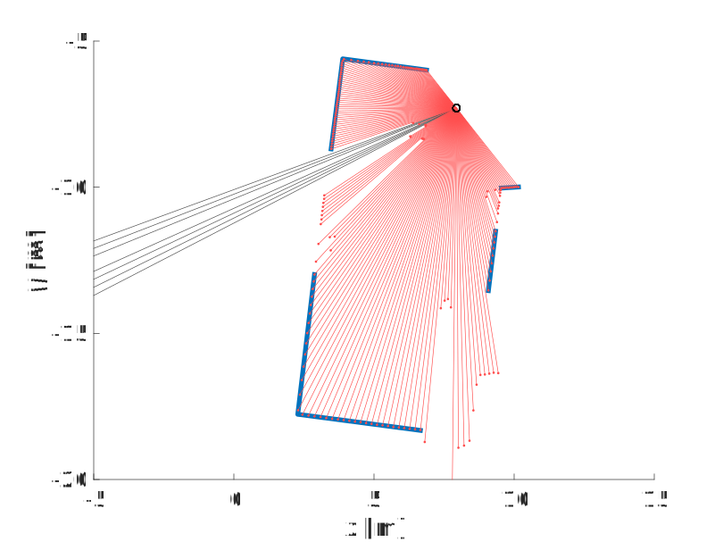

# PLE: Probabilistic Line Extraction from 2-D Laser Range Scans



Exemplary result of our polyline extraction method applied to a scan captured in an office. The scan consists of 361 rays, of which every second is displayed as a red line. Gray lines indicate maximum-range readings. The extracted polyline map, drawn as blue lines, consists of ten vertices, reducing memory requirements to less than 3%.  

## About this Repository

This repository contains the [MATLAB](https://www.mathworks.com/products/matlab.html) implementation of [our maximum likelihood approach to extract polylines from 2-D range scans](http://ais.informatik.uni-freiburg.de/publications/papers/schaefer18icra.pdf). It also comprises the scripts we used in the experiments to compare our method to several state-of-the-art line extractors.

## The Algorithm in a Nutshell

Our approach extracts polylines from 2-D laser range scans. In contrast to prevalent line extraction techniques, it does not rely on a geometric heuristic, but maximizes the measurement probability of the scan to accurately determine polylines. The method consists of two steps.
1. **Polyline Extraction.** Polyline extraction starts by connecting all neighboring scan endpoints to form a set of initial polylines. It then iteratively removes the vertex that incurs the least error in terms of measurement probability until it reaches a given threshold. The result is a set of polylines whose vertex locations coincide with the locations of a subset of the scan endpoints. 
1. **Polyline Optimization.** To do away with the limitation that vertex locations coincide with endpoint locations, we formulate an optimization problem that moves the vertices to the positions that maximize the measurement probability of the scan. We call this latter process polyline optimization.

For a detailed description of our method and the experiments, please have a look at our [paper](http://ais.informatik.uni-freiburg.de/publications/papers/schaefer18iros.pdf).

## Quick Start Instructions

The code does not require compilation or installation. To run a line extraction example, follow these steps:
1. Clone or [download](https://github.com/acschaefer/ple/archive/master.zip) the repository.
1. Add the folder `matlab` and all subfolders to your MATLAB searchpath.
1. Run the example script `matlab/extrlin.m`.

## Repository Organization

All code is located in the folder `matlab`. This folder contains multiple subfolders:

| Subfolder | Content |
| --- | --- |
| `.` | functions and classes required to run examples and experiments |
| `data` | laser scan files and results of experiments with Veeck's method |
| `script` | example and experiments scripts |

## Supported Platforms and MATLAB Versions

It is not bound to any specific platform. It was tested on MATLAB R2017b and MATLAB R2018a on Windows and Linux systems. If you experience any problems, please do not hesitate to [create an issue](https://github.com/acschaefer/ple/issues/new).

## License

All code in this repository is licensed under [GPL-3.0](LICENSE).

## How to Cite

If you use our line extraction method in your research, please cite our [paper](http://ais.informatik.uni-freiburg.de/publications/papers/schaefer18iros.pdf) that describes the approach:
```
A Maximum Likelihood Approach to Extract Polylines from 2-D Laser Range Scans
Alexander Schaefer, Daniel Büscher, Lukas Luft, Wolfram Burgard
IEEE International Conference on Intelligent Robots 2018, Madrid, Spain
```
