# 2-D Lidar Indoor Datasets from Radish

The datasets below taken from [Radish: The Robotics Data Set Repository](http://radish.sourceforge.net/). They contain odometry and 2-D lidar data. They are provided in the [Carmen logging format](http://carmen.sourceforge.net/logger_playback.html).

To load a dataset into the MATLAB workspace, use the function [`carmenread`](matlab/carmenread.m).

## MIT, CSAIL Building (`csail-corrected.log.gz`)
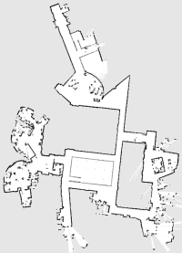

## Freiburg Campus (`freiburg-campus-corrected.log.gz`)
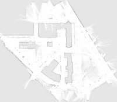

## Intel Reserach Lab (`intel-corrected.log.gz`)
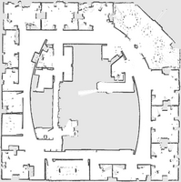

## University of Washington, Seattle (`seattle-corrected.log.gz`)
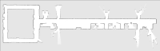

## MIT Infinite Corridor Dataset (`infinite-corridor-corrected.log.gz`)
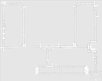

## Örebro University (`orebro-corrected.log.gz`)
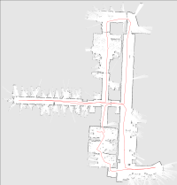

## Belgioioso Castle (`belgioioso-corrected.log.gz`)

## FHW Museum (`fhw-corrected.log.gz`)
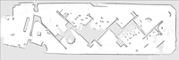

## University of Austin, ACES building (`aces-corrected.log.gz`)
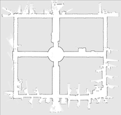

## Edmonton Convention Centre (`edmonton-corrected.log.gz`)
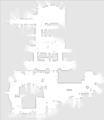

## University of Freiburg, Building 079 (`freiburg-079-corrected.log.gz`)
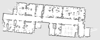

## University of Freiburg, Building 101 (`freiburg-101-corrected.log.gz`)
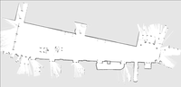

## Acapulco Convention Center (`acapulco-corrected.log.gz`)

